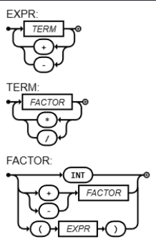

# Ling-Pad-GitHub

[](https://compiler-tester.insper-comp.com.br/svg/Uyris/Ling-Pad-GitHub)

## Diagrama Sintático



**Descrição:** A expressão começa com um `NUMBER`, seguido de zero ou mais operações `+` ou `-`, cada uma seguida por outro `NUMBER`.

a EBNF equivalente do compilador é:
```bash
EXPRESSION = TERM, { ("+" | "-"), TERM } ;
TERM = FACTOR, { ("*" | "/"), FACTOR } ;
FACTOR = ("+" | "-"), FACTOR | "(", EXPRESSION, ")" | NUMBER ;
NUMBER = DIGIT, {DIGIT} ;
DIGIT = 0 | 1 | ... | 9 ;
```